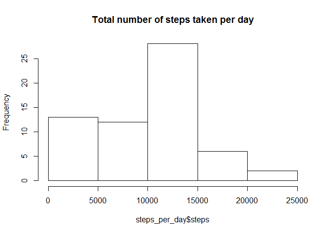
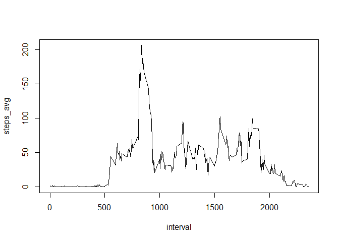
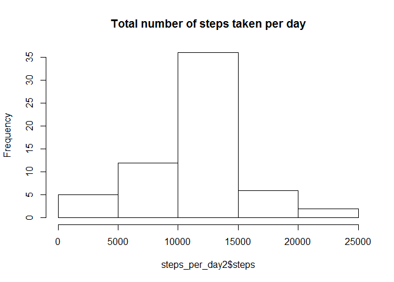
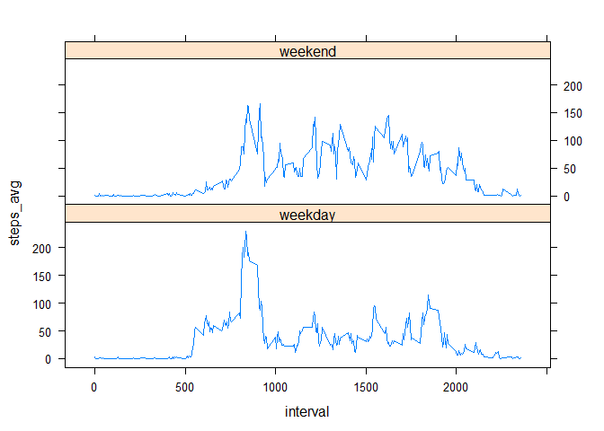

# Reproducible Research Project 1


## Load the package and data

Load the package.

```r
library(dplyr)
```

```
## 
## Attaching package: 'dplyr'
```

```
## The following objects are masked from 'package:stats':
## 
##     filter, lag
```

```
## The following objects are masked from 'package:base':
## 
##     intersect, setdiff, setequal, union
```

```r
library(lattice)
```


Download and upzip data.


```r
download.file("https://d396qusza40orc.cloudfront.net/repdata%2Fdata%2Factivity.zip", "activity.zip")
unzip("activity.zip")
```

Read the data. Transform the date column into date format.


```r
data <- read.csv("activity.csv")
data$date <- as.Date(data$date)
str(data)
```

```
## 'data.frame':	17568 obs. of  3 variables:
##  $ steps   : int  NA NA NA NA NA NA NA NA NA NA ...
##  $ date    : Date, format: "2012-10-01" "2012-10-01" ...
##  $ interval: int  0 5 10 15 20 25 30 35 40 45 ...
```

```r
summary(data)
```

```
##      steps             date               interval     
##  Min.   :  0.00   Min.   :2012-10-01   Min.   :   0.0  
##  1st Qu.:  0.00   1st Qu.:2012-10-16   1st Qu.: 588.8  
##  Median :  0.00   Median :2012-10-31   Median :1177.5  
##  Mean   : 37.38   Mean   :2012-10-31   Mean   :1177.5  
##  3rd Qu.: 12.00   3rd Qu.:2012-11-15   3rd Qu.:1766.2  
##  Max.   :806.00   Max.   :2012-11-30   Max.   :2355.0  
##  NA's   :2304
```

```r
head(data,6)
```

```
##   steps       date interval
## 1    NA 2012-10-01        0
## 2    NA 2012-10-01        5
## 3    NA 2012-10-01       10
## 4    NA 2012-10-01       15
## 5    NA 2012-10-01       20
## 6    NA 2012-10-01       25
```


## What is mean total number of steps taken per day?


```r
steps_per_day <- data %>% group_by(date) %>% summarise_at(vars(steps), funs(sum(., na.rm = TRUE)))
hist(steps_per_day$steps, main = "Total number of steps taken per day")
```

<!-- -->

```r
steps_per_day_mean = mean(steps_per_day$steps)
steps_per_day_median = median(steps_per_day$steps)
```

**The mean of the total number of steps taken per day is 9354.2295082, the median is 10395.**


## What is the average daily activity pattern?


```r
steps_per_interval <- data %>% group_by(interval) %>% summarise_at(vars(steps), funs(steps_avg = mean(., na.rm = TRUE)))
head(steps_per_interval)
```

```
## # A tibble: 6 × 2
##   interval steps_avg
##      <int>     <dbl>
## 1        0 1.7169811
## 2        5 0.3396226
## 3       10 0.1320755
## 4       15 0.1509434
## 5       20 0.0754717
## 6       25 2.0943396
```

```r
with(steps_per_interval, plot(interval, steps_avg, type = "l"))
```

<!-- -->

```r
steps_per_interval_max <- max(steps_per_interval$steps_avg)
steps_per_interval_max_loc <- steps_per_interval$interval[which(steps_per_interval$steps_avg == steps_per_interval_max)]
```

**The 5-minute interval whose value is 835 has the maximum averaged number of steps.**  
**The maximum is 206.1698113.**


## Imputing missing values


```r
num_missing <- sum(is.na(data$steps))
```

**The total number of missing values is 2304. **  

Use the averaged number of steps in each 5-min interval to imput the missing data.  


```r
data2 <- data
missingRows <- data2[is.na(data2$steps), ]
imputedRows<- left_join(missingRows, steps_per_interval, by = "interval")
data2$steps[is.na(data2$steps)] <- imputedRows$steps_avg
```

data2 is the new dataset after imputation of missing values.


```r
steps_per_day2 <- data2 %>% group_by(date) %>% summarise_at(vars(steps), funs(sum(., na.rm = TRUE)))
hist(steps_per_day2$steps, main = "Total number of steps taken per day")
```

<!-- -->

```r
steps_per_day_mean2 = mean(steps_per_day2$steps)
steps_per_day_median2 = median(steps_per_day2$steps)
```

**After imputing the missing values, the mean of the total number of steps taken per day is 1.0766189\times 10^{4}, the median is 1.0766189\times 10^{4}. The values differ from the estimates from the first part of the assignment. Imputing missing data reduces the frequency of having a small total number of steps in a day, and makes the histogram more symmetric. **


## Are there differences in activity patterns between weekdays and weekends?

Create a new factor variable in the dataset with two levels - "weekday" and "weekend" indicating whether a given date is a weekday or weekend day.


```r
data2 <- mutate(data2, day = weekdays(date))
whatdayis <- data.frame(day = c("Monday", "Tuesday", "Wednesday", "Thursday", "Friday", "Saturday", "Sunday"), 
                        isWeekday = c("weekday", "weekday", "weekday", "weekday", "weekday", "weekend", "weekend"))
data2 <- left_join(data2, whatdayis, by = "day")
```

```
## Warning in left_join_impl(x, y, by$x, by$y, suffix$x, suffix$y): joining
## factor and character vector, coercing into character vector
```

Make a panel plot containing a time series plot of the 5-minute interval (x-axis) and the average number of steps taken, averaged across all weekday days or weekend days (y-axis).


```r
steps_per_interval2 <- data2 %>% group_by(isWeekday, interval) %>% summarise_at(vars(steps), funs(steps_avg = mean(., na.rm = TRUE)))
xyplot(steps_avg ~ interval | isWeekday, data = steps_per_interval2, type = "l", layout = c(1, 2))
```

<!-- -->

